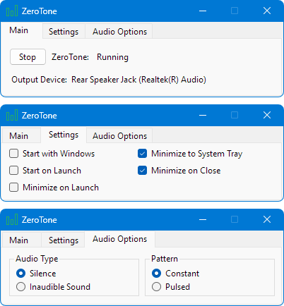
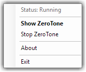

# ZeroTone

**Because the first second counts.**

A Windows tray utility that keeps your default playback device awake, so the start of real audio isn’t cut off.

S/PDIF receivers, HDMI TVs, Bluetooth headphones, and some sound cards go idle and drop the connection. Waking up can take long enough that the first note, word, or effect is clipped or delayed. ZeroTone holds the **default playback device** open with silence or near-silence, the same way other audio apps play to that device.

## Why this exists

Other keep-alive tools tend to do one of two things. Some loop a silent file and show “running” whether or not the output is still up. Some run with no window at all: they start when the process starts, you configure them by renaming the executable, and you stop them by ending the process.

ZeroTone is a normal tray app: you can see it, start it, and stop it. It does not keep a green “running” icon over a dead session.

## Screenshots

Main (status, output device, Start/Stop), Settings (autostart and tray), and Audio Options (Silence/Inaudible, Constant/Pulsed):



Tray icon when Running:


Tray menu (status, Start/Stop, Exit):



## Download

The latest `ZeroTone.exe` is on [GitHub Releases](https://github.com/ngreyling/ZeroTone/releases/latest) (64-bit Windows, typically under 1 MB). Copy the file and run it; there is no installer.

It needs the [.NET 10 Desktop Runtime](https://dotnet.microsoft.com/download/dotnet/10.0) on the PC. A larger self-contained build (runtime included) is described under [Publish](#publish).

## Use it

- Click **Start** to begin keep-alive, or enable **Start on Launch** so it starts when ZeroTone starts.
- Check the **tray icon** for status. The Main tab and tray menu show the same short status.
- **Start with Windows** launches the app when you sign in. Turn on **Start on Launch** to begin keep-alive, and **Minimize on Launch** to stay in the tray.
- Close and minimize go to the tray by default; they do not quit. Use **Exit** on the tray menu to quit.
- Click the tray icon (or **Show ZeroTone**) to bring the window back. A second launch does the same.
- Running also adds a ZeroTone row in the volume mixer. Mute or 0% there can defeat keep-alive (especially **Inaudible Sound**). Status stays Running and shows that the mixer row is muted or at zero.

## What it does

- **Keep-alive.** Plays silence or a very quiet tone the same way other apps play to the device, not a looping silent file.
- **Recovery.** Follows the default playback device when you switch outputs, and starts again after sleep. If another app takes exclusive control, you unplug the device, or Bluetooth drops the stream, keep-alive stays on. Constant retries until it is playing again; Pulsed waits for the next pulse.
- **You can tell.** Green means ZeroTone is actually playing to the device, not that you pressed Start. The Main tab shows the current output device by name.
- **Set-and-forget.** It can start when you sign in, start keep-alive, and stay in the tray with no window.
- **Portable.** No installer.

Hover Audio Type, Pattern, and the status on the Main tab for short when-to-use tips and more status detail.

## Audio Type and Pattern

| Audio Type | What it does |
|------------|----------------|
| **Silence** | Digital silence (zeros). Start here. If the output still sleeps, use Inaudible Sound. |
| **Inaudible Sound** | A very quiet tone for outputs that ignore pure digital silence. Prefer Silence unless the output still sleeps. |

| Pattern | What it does |
|---------|----------------|
| **Constant** | Continuous keep-alive. Start here. It holds outputs that sleep quickly. |
| **Pulsed** | 1 second every 10 seconds. If the output sleeps before the next pulse, use Constant. |

## Status

| Status | Meaning |
|--------|---------|
| **Starting...** (amber) | Opening the default playback device after Start or Start on Launch. Not playing yet. |
| **Running** (green) | ZeroTone is playing to the device. If the mixer row is muted or at 0%, the label says so. |
| **Reconnecting...** (amber) | Keep-alive is still on; opening the device again after a device change, sleep, or a lost stream. |
| **Stopped** (red) | Keep-alive is off. |

## Scope

ZeroTone keeps the **default playback device** awake — the one Windows uses for music, films, and games. It does not hold every output at once, and it does not follow a headset that is only the default communications device. It never unmutes its own mixer row or changes that volume.

Like any app that is playing, Constant keep-alive can keep the PC from auto-sleeping on some Windows 11 setups.

## Requirements

- **To run** the small exe: 64-bit Windows 10 or later and the [.NET 10 Desktop Runtime](https://dotnet.microsoft.com/download/dotnet/10.0). A publish that includes the runtime needs no extra install.
- **To build:** the [.NET 10 SDK](https://dotnet.microsoft.com/download)

## Run from source

```powershell
dotnet run --project src\ZeroTone
```

Open `ZeroTone.sln` in Visual Studio or JetBrains Rider if you prefer an IDE.

## Publish

Small exe (needs **.NET 10 Desktop Runtime** on the PC; the runtime is **not** bundled):

```powershell
dotnet publish src\ZeroTone -c Release -r win-x64 -p:PublishSingleFile=true -p:PublishSelfContained=false -p:DebugType=None -p:DebugSymbols=false
```

**Output:** `src\ZeroTone\bin\Release\net10.0-windows\win-x64\publish\ZeroTone.exe`, typically under 1 MB. Ship that file (or the `publish` folder), not the rest of `bin`.

On .NET 8+, `PublishSingleFile=true` implies a self-contained publish unless you also pass `PublishSelfContained=false`. Omit that flag and the exe can jump to **~100+ MB**. Use the full command above.

Self-contained (runtime bundled, no .NET install on the target PC, much larger):

```powershell
dotnet publish src\ZeroTone -c Release -r win-x64 -p:PublishSingleFile=true -p:PublishSelfContained=true
```

## Settings

Preferences are stored in `%AppData%\ZeroTone\settings.json` (created when you change a setting).

**Start with Windows** is not in that file. It is a per-user sign-in entry (`HKCU\...\Run`). Unchecking the box is the cleanup. It also appears in Task Manager under Startup apps; disabling it there is respected. Copying `settings.json` to another PC does not register autostart.

## Credits

ZeroTone was inspired by [SPDIF Keep Alive](https://github.com/handruin/spdif-ka) (spdif-ka) by [handruin](https://github.com/handruin). Early development used some of that project’s code; ZeroTone has since been substantially rewritten and expanded, and is a separate product.

## License

[MIT](LICENSE).

ZeroTone. Because the first second counts.
